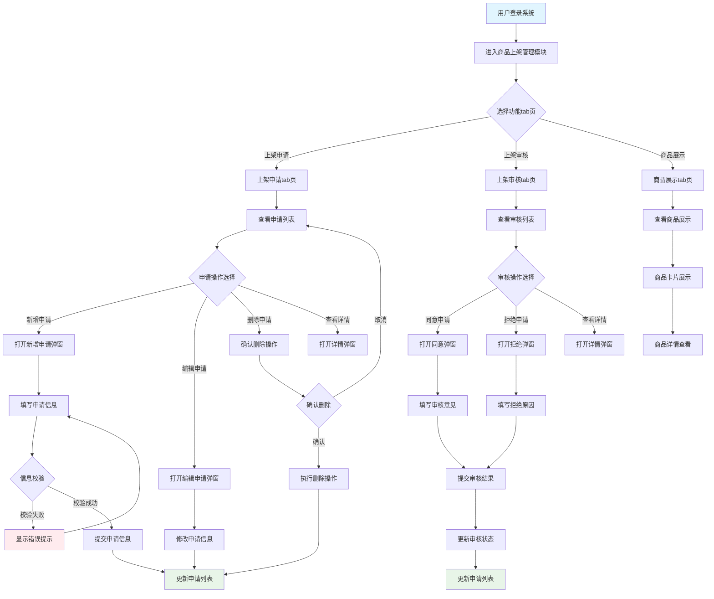
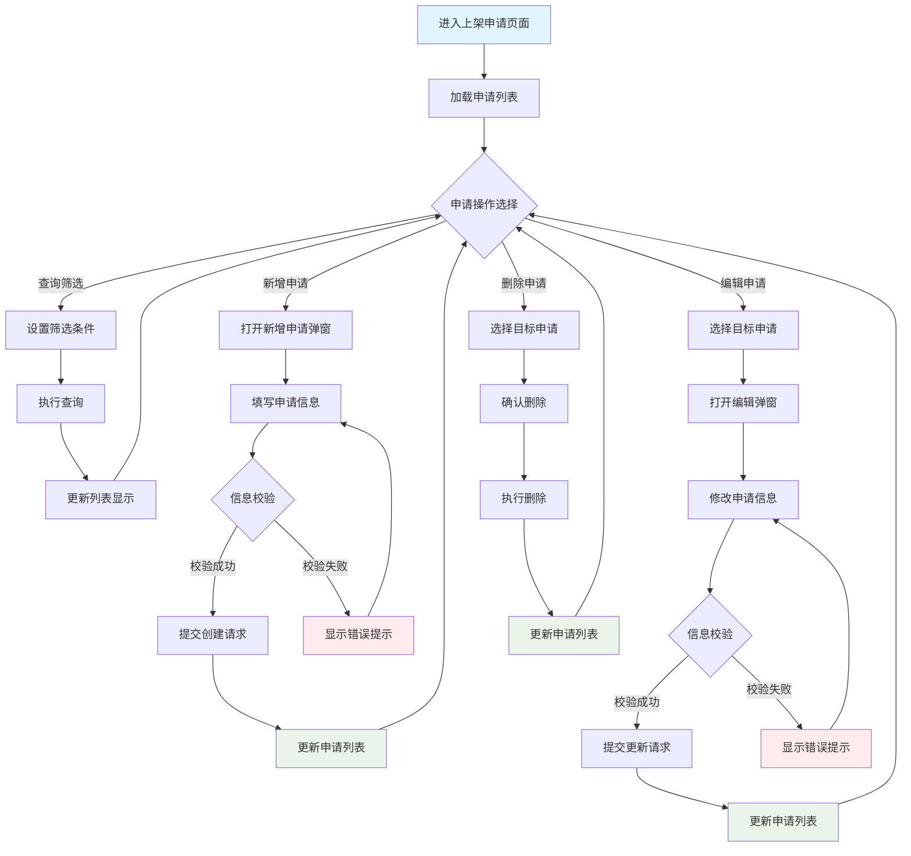
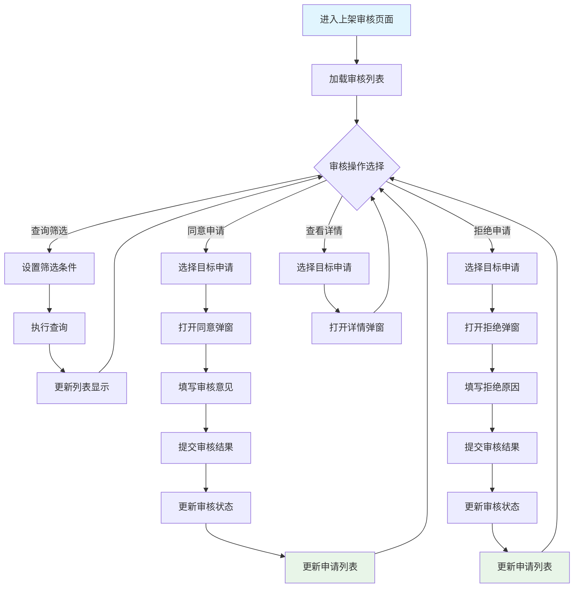
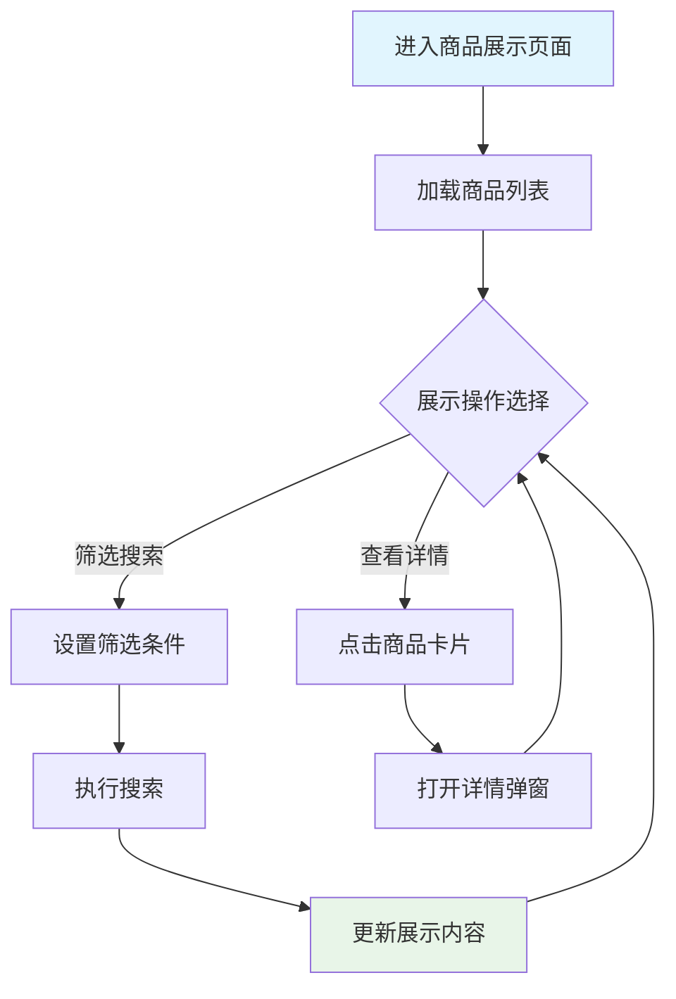

# 商品上架管理系统设计文档
## 系统架构
### 导航结构
系统主要包含以下模块：
- **商品管理**：包含商品上架管理等业务功能
- **系统管理**：包含用户管理、日志管理等系统功能
  - 用户管理：管理系统用户信息、权限等
  - 日志管理：管理系统操作日志、审计日志等
## 业务流程
商品上架管理模块的核心业务流程如下：

## 页面清单
| 页面名称 | 页面路径 | 页面描述 | 主要栏目 | 数据流向 | 包含元素 | 其他 |
| -------- | -------- | -------- | -------- | -------- | -------- | ---- |
| 商品上架申请tab页 | 商品管理 > 商品上架管理 > 上架申请 | 管理商品上架申请的创建、编辑、删除和查看，支持申请状态管理和批量操作 | 申请查询区、申请列表、操作按钮区 | 输入：申请查询条件；输出：申请列表数据、操作结果反馈 | 查询筛选栏、申请数据列表、新增申请弹窗、分页组件 | 与用户管理页面数据关联，申请删除需检查审核状态 |
| 商品上架审核tab页 | 商品管理 > 商品上架管理 > 上架审核 | 管理商品上架申请的审核流程，支持同意、拒绝操作和审核状态管理 | 审核查询区、审核列表、操作按钮区 | 输入：审核查询条件、审核结果；输出：审核列表数据、审核状态更新 | 查询筛选栏、审核数据列表、审核操作弹窗、分页组件 | 与申请tab页数据同步，审核完成后自动更新申请状态 |
| 商品展示tab页 | 商品管理 > 商品上架管理 > 商品展示 | 展示已通过审核的商品信息，以卡片形式展示商品详情 | 商品展示区、筛选功能区 | 输入：展示筛选条件；输出：商品展示数据 | 商品卡片网格、筛选控件、搜索功能 | 只显示审核通过的商品，与审核tab页状态关联 |
## 功能设计详情
### 商品上架申请tab页
#### 功能基本信息
- **页面标题**：商品上架申请
- **页面路径**：商品管理 > 商品上架管理 > 上架申请
- **功能状态**：🆕 新增功能
#### 功能概述
- **页面目标与定位**：为商品管理员提供完整的商品上架申请管理功能，包括申请的创建、查看、编辑、删除和状态跟踪，确保商品上架流程的规范化管理。
- **数据展示与用户操作**：以申请列表为核心展示所有商品上架申请信息，支持多维度查询筛选，提供行级和页面级操作满足不同管理需求。
- **列表核心地位**：申请列表作为页面主体，所有申请管理操作都围绕列表展开，操作完成后实时更新列表状态，确保数据一致性和操作闭环。
#### 页面功能流程

#### 数据流
##### 输入 (Inputs)
- **申请查询条件**：用户手动输入的筛选条件（商品名称、状态、申请人、审批人等），用于列表数据筛选
- **申请基本信息**：用户在弹窗表单中输入的申请数据，包括商品名称、商品描述、上架原因、上架时间等必填和选填字段
- **分页参数**：用户操作的页码和每页条目数，用于列表数据分页加载
##### 处理 (Processing)
- **数据校验**：对用户输入的信息进行格式校验、长度校验、必填项校验等业务规则验证
- **权限检查**：验证当前操作用户是否具有相应的申请管理权限
- **状态管理**：处理申请状态变更时的业务逻辑，如编辑申请时检查是否已进入审核流程
##### 输出 (Outputs)
- **申请列表数据**：经过筛选和分页的申请信息列表，展示给用户查看
- **操作结果反馈**：各类操作的成功或失败提示信息，指导用户下一步操作
- **状态同步**：申请状态变更后自动同步到审核tab页和展示tab页
#### 页面布局设计详情
##### 页面布局图
```
+-------------------------------------------------------------+
| **商品管理** | 系统管理                                        [用户] [设置] |
+-------------------------------------------------------------+
| 商品管理 > 商品上架管理 > 上架申请                             |
+-------------------------------------------------------------+
| 商品上架管理                                                    |
+-------------------------------------------------------------+
| [**上架申请**] [上架审核] [商品展示]                           |
+=============================================================+
| 商品名称:[____] 状态:[全部▼] 申请人:[全部▼] [搜索] [重置] [新增申请] |
+=============================================================+
|| □ | 商品名称    | 商品描述      | 上架原因   | 上架时间   | 申请人   | 审批人   | 状态     | 申请时间   | 操作           ||
||===========================================================||
|| ☑ | 商品A      | 优质商品描述  | 市场需求   | 2024-02-01 | 张三     | 李四     | 待审核   | 2024-01-30 | [查看][编辑][删除] ||
|| ☐ | 商品B      | 新品上市      | 促销活动   | 2024-02-15 | 王五     | 赵六     | 已审核   | 2024-01-31 | [查看][编辑][删除] ||
+=============================================================+
|              共 25 条  [上一页] 1 2 3 [下一页]               |
+-------------------------------------------------------------+
```
##### 交互说明
页面主要交互元素的触发条件和系统响应：
| 元素名称     | 触发条件                     | 系统行为与逻辑                               | 页面响应与状态变化                                     | 异常处理                               |
| ------------ | ---------------------------- | -------------------------------------------- | ------------------------------------------------------ | -------------------------------------- |
| 搜索按钮     | 用户点击搜索按钮             | 根据查询条件筛选申请列表，发送查询请求到后端 | 列表区域显示加载状态，查询完成后更新列表数据和分页信息 | 查询失败时显示错误提示，保持原列表状态 |
| 重置按钮     | 用户点击重置按钮             | 清空所有查询条件，恢复默认筛选状态           | 查询条件重置为默认值，列表显示全部申请数据             | 重置操作本地执行，无网络异常风险       |
| 新增申请按钮 | 用户点击新增申请按钮         | 打开新增申请弹窗，初始化空表单               | 页面显示遮罩层，弹窗居中显示，表单字段为空白状态       | 弹窗打开失败时显示错误提示             |
| 编辑按钮     | 用户点击某行的编辑按钮       | 获取该申请详细信息，打开编辑申请弹窗         | 弹窗显示，表单字段填充该申请的当前信息                 | 获取申请信息失败时显示错误提示         |
##### 页面功能区详情
###### 主体列表
申请列表是页面的核心展示区域，包含查询筛选、数据展示、操作功能等模块。
**查询与筛选功能**
查询字段支持商品名称模糊搜索、状态和申请人的精确筛选：
| 查询字段名称 | 匹配方式 | 默认查询条件 | 筛选控件类型 | 其他                   |
| ------------ | -------- | ------------ | ------------ | ---------------------- |
| 商品名称     | 模糊匹配 | 无           | 输入框       | 支持实时搜索建议       |
| 状态         | 精确匹配 | 全部         | 下拉选择     | 选项：全部、待审核、已审核 |
| 申请人       | 精确匹配 | 全部         | 下拉选择     | 动态获取用户列表       |
查询栏操作按钮提供搜索和重置功能：
| 按钮名称 | 触发操作                 | 按钮位置     | 其他                   |
| -------- | ------------------------ | ------------ | ---------------------- |
| 搜索     | 根据查询条件筛选申请列表 | 查询字段右侧 | 主要操作按钮，蓝色样式 |
| 重置     | 清空查询条件恢复默认状态 | 搜索按钮右侧 | 次要操作按钮，灰色样式 |
**数据列表**
数据列表展示申请的基本信息，包含必要的数据字段和校验规则：
| 字段名   | 数据类型 | 是否必填 | 校验规则                 | 默认值   | 是否可编辑   | 数据来源     | 显示优先级 | 排序支持 | 其他         |
| -------- | -------- | -------- | ------------------------ | -------- | ------------ | ------------ | ---------- | -------- | ------------ |
| 商品名称 | 文本     | 是       | 1-100字符，不能为空      | 无       | 创建时可编辑 | 用户输入     | 必显       | 支持     | 支持重复名称 |
| 商品描述 | 文本     | 否       | 最大500字符              | 无       | 是           | 用户输入     | 必显       | 支持     | 支持富文本   |
| 上架原因 | 文本     | 是       | 1-200字符，不能为空      | 无       | 是           | 用户输入     | 必显       | 支持     | 必填字段     |
| 上架时间 | 日期     | 是       | 不能早于当前日期         | 无       | 是           | 用户选择     | 必显       | 支持     | 日期选择器   |
| 申请人   | 枚举     | 是       | 从用户列表选择           | 当前用户 | 否           | 系统自动     | 必显       | 支持     | 自动填充     |
| 审批人   | 枚举     | 是       | 从用户列表选择           | 无       | 是           | 用户选择     | 必显       | 支持     | 必填字段     |
| 状态     | 枚举     | 是       | 待审核/已审核            | 待审核   | 否           | 系统设置     | 必显       | 支持     | 自动更新     |
| 申请时间 | 日期时间 | 否       | 无                       | 当前时间 | 否           | 系统生成     | 必显       | 支持     | 默认降序排列 |
**列表操作项**
行级操作提供查看、编辑、删除等功能：
| 按钮名称 | 触发条件               | 交互行为                         | 其他                 |
| -------- | ---------------------- | -------------------------------- | -------------------- |
| 查看     | 所有用户               | 打开申请详情弹窗，只读显示       | 行级操作             |
| 编辑     | 有编辑权限且状态为待审核 | 打开编辑申请弹窗，预填充申请信息 | 行级操作             |
| 删除     | 有删除权限且状态为待审核 | 打开删除确认弹窗                 | 行级操作，不可逆操作 |
**分页组件**
分页功能支持大数据量的展示和导航：
| 每页条目数 | 页码导航                             | 信息展示                       | 导航控制                     |
| ---------- | ------------------------------------ | ------------------------------ | ---------------------------- |
| 默认20条   | 首页、上一页、下一页、末页、页码跳转 | 显示总条目数、总页数、当前页码 | 页码按钮点击，输入框直接跳转 |
**状态说明**
列表在不同情况下的展示状态和用户引导：
| 状态类型 | 展示内容                             | 功能说明             | 交互行为                   |
| -------- | ------------------------------------ | -------------------- | -------------------------- |
| 空状态   | "暂无申请数据，点击新增申请开始使用" | 无数据时的引导提示   | 包含新增申请引导按钮       |
| 加载状态 | 骨架屏显示                           | 数据加载过程指示     | 保持列表结构完整性         |
| 错误状态 | "数据加载失败，请刷新重试"           | 加载失败时的错误提示 | 提供重试按钮               |
| 选择状态 | 行高亮显示                           | 支持单选和多选       | 批量操作按钮随选择状态变化 |
###### 页面操作按钮
页面级操作按钮提供新增申请功能：
| 按钮名称 | 显示/启用条件        | 交互行为             | 视觉层级 | 位置布局       |
| -------- | -------------------- | -------------------- | -------- | -------------- |
| 新增申请 | 有新增权限           | 打开新增申请弹窗     | 主按钮   | 列表右上方     |
#### 弹窗/表单设计详情
##### 新增申请弹窗
###### 弹窗布局图
```
+-------------------------------------------------------------+
| 新增商品上架申请                                          [×] |
+-------------------------------------------------------------+
| 请填写商品上架申请信息                                      |
|                                                             |
|  商品名称: [________________] *                            |
|  商品描述: [________________]                              |
|          [________________]                              |
|  上架原因: [________________] *                            |
|  上架时间: [2024-02-01 ▼] *                               |
|  申请描述: [________________]                              |
|          [________________]                              |
|  审批人:   [选择审批人 ▼] *                                |
|                                                             |
|  备注:     [________________]                              |
|            [________________]                              |
|                                                             |
+-------------------------------------------------------------+
|                       [取消]          [确认]                |
+-------------------------------------------------------------+
```
###### 交互说明
弹窗主要交互元素的操作逻辑：
| 元素名称     | 触发条件                   | 系统行为与逻辑                     | 页面响应与状态变化                         | 异常处理                             |
| ------------ | -------------------------- | ---------------------------------- | ------------------------------------------ | ------------------------------------ |
| 确认按钮     | 用户点击确认且表单校验通过 | 提交申请数据到后端，创建新申请记录 | 弹窗关闭，列表刷新显示新申请，显示成功提示 | 创建失败时显示错误信息，保持弹窗开启 |
| 取消按钮     | 用户点击取消按钮           | 关闭弹窗，不保存任何修改           | 弹窗关闭，返回申请列表页面，表单数据丢弃   | 无异常情况                           |
| 关闭按钮(×) | 用户点击右上角关闭按钮     | 等同于取消操作，关闭弹窗           | 弹窗关闭，返回申请列表页面                 | 无异常情况                           |
###### 弹窗功能区详情
**弹窗基本信息**
| 项目     | 内容               | 说明                                   |
| -------- | ------------------ | -------------------------------------- |
| 弹窗标题 | 新增商品上架申请   | 明确表示当前操作类型                   |
| 触发机制 | 点击新增申请按钮   | 用户在申请页面点击新增申请按钮触发     |
| 内容规范 | 申请信息表单       | 承载商品上架申请信息输入表单           |
| 操作按钮 | 取消、确认         | 取消为次要按钮，确认为主要按钮         |
| 尺寸定义 | 中等尺寸弹窗       | 适合表单内容的标准尺寸                 |
| 关闭方式 | 按钮关闭、遮罩关闭 | 支持取消按钮、右上角X按钮关闭          |
**表单字段**
表单包含商品上架申请信息的输入字段，支持数据校验和实时反馈：
| 字段标签 | 字段名       | 数据类型 | 必填项 | 校验规则                         | 默认值   | 是否可编辑 | 提示信息       | 选项来源        | UI控件类型   |
| -------- | ------------ | -------- | ------ | -------------------------------- | -------- | ---------- | -------------- | --------------- | ------------ |
| 商品名称 | productName  | 字符串   | 是     | 1-100字符，不能为空              | 无       | 是         | 请输入商品名称 | 用户输入        | input        |
| 商品描述 | description  | 字符串   | 否     | 最大500字符                      | 无       | 是         | 请输入商品描述 | 用户输入        | textarea     |
| 上架原因 | reason       | 字符串   | 是     | 1-200字符，不能为空              | 无       | 是         | 请输入上架原因 | 用户输入        | input        |
| 上架时间 | shelfTime    | 日期     | 是     | 不能早于当前日期                 | 无       | 是         | 选择上架时间   | 用户选择        | date picker  |
| 申请描述 | applyDesc    | 字符串   | 否     | 最大500字符                      | 无       | 是         | 请输入申请描述 | 用户输入        | textarea     |
| 审批人   | approver     | 枚举     | 是     | 从用户列表选择                   | 无       | 是         | 选择审批人     | 用户管理API     | select       |
| 备注     | remark       | 文本     | 否     | 最大200字符                      | 无       | 是         | 可选备注信息   | 用户输入        | textarea     |
### 商品上架审核tab页
#### 功能基本信息
- **页面标题**：商品上架审核
- **页面路径**：商品管理 > 商品上架管理 > 上架审核
- **功能状态**：🆕 新增功能
#### 功能概述
- **页面目标与定位**：为审批人员提供商品上架申请的审核管理功能，包括申请的查看、审核操作和状态管理，确保商品上架流程的规范化审核。
- **数据展示与用户操作**：以审核列表为核心展示所有待审核和已审核的申请信息，支持多维度查询筛选，提供审核操作功能。
- **列表核心地位**：审核列表作为页面主体，所有审核操作都围绕列表展开，操作完成后实时更新列表状态，确保数据一致性和操作闭环。
#### 页面功能流程

#### 数据流
##### 输入 (Inputs)
- **审核查询条件**：用户手动输入的筛选条件（商品名称、状态、申请人、审批人等），用于列表数据筛选
- **审核结果信息**：用户在审核弹窗中输入的审核意见、拒绝原因等审核数据
- **分页参数**：用户操作的页码和每页条目数，用于列表数据分页加载
##### 处理 (Processing)
- **权限检查**：验证当前操作用户是否具有相应的审核权限
- **状态转换**：处理申请状态从待审核到已审核的转换逻辑
- **数据同步**：审核完成后自动同步状态到申请tab页和展示tab页
##### 输出 (Outputs)
- **审核列表数据**：经过筛选和分页的审核信息列表，展示给审批人员查看
- **审核状态更新**：审核操作完成后自动更新申请状态和列表显示
- **操作结果反馈**：各类操作的成功或失败提示信息，指导用户下一步操作
#### 页面布局设计详情
##### 页面布局图
```
+-------------------------------------------------------------+
| **商品管理** | 系统管理                                        [用户] [设置] |
+-------------------------------------------------------------+
| 商品管理 > 商品上架管理 > 上架审核                             |
+-------------------------------------------------------------+
| 商品上架管理                                                    |
+-------------------------------------------------------------+
| [上架申请] [**上架审核**] [商品展示]                           |
+=============================================================+
| 商品名称:[____] 状态:[全部▼] 申请人:[全部▼] [搜索] [重置]      |
+=============================================================+
|| □ | 商品名称    | 上架原因   | 上架时间   | 申请人   | 审批人   | 状态     | 申请时间   | 操作           ||
||===========================================================||
|| ☑ | 商品A      | 市场需求   | 2024-02-01 | 张三     | 李四     | 待审核   | 2024-01-30 | [同意][拒绝][查看] ||
|| ☐ | 商品B      | 促销活动   | 2024-02-15 | 王五     | 赵六     | 已审核   | 2024-01-31 | [查看]           ||
+=============================================================+
|              共 25 条  [上一页] 1 2 3 [下一页]               |
+-------------------------------------------------------------+
```
##### 页面功能区详情
**数据列表**
审核列表展示申请的基本信息和审核状态：
| 字段名   | 数据类型 | 是否必填 | 校验规则                 | 默认值   | 是否可编辑   | 数据来源     | 显示优先级 | 排序支持 | 其他         |
| -------- | -------- | -------- | ------------------------ | -------- | ------------ | ------------ | ---------- | -------- | ------------ |
| 商品名称 | 文本     | 是       | 1-100字符                | 无       | 否           | 申请数据     | 必显       | 支持     | 只读显示     |
| 上架原因 | 文本     | 是       | 1-200字符                | 无       | 否           | 申请数据     | 必显       | 支持     | 只读显示     |
| 上架时间 | 日期     | 是       | 日期格式                 | 无       | 否           | 申请数据     | 必显       | 支持     | 只读显示     |
| 申请人   | 枚举     | 是       | 从用户列表获取           | 无       | 否           | 申请数据     | 必显       | 支持     | 只读显示     |
| 审批人   | 枚举     | 是       | 从用户列表获取           | 无       | 否           | 申请数据     | 必显       | 支持     | 只读显示     |
| 状态     | 枚举     | 是       | 待审核/已审核            | 待审核   | 否           | 系统设置     | 必显       | 支持     | 自动更新     |
| 申请时间 | 日期时间 | 否       | 无                       | 当前时间 | 否           | 系统生成     | 必显       | 支持     | 默认降序排列 |
**列表操作项**
行级操作提供审核操作和查看功能：
| 按钮名称 | 触发条件               | 交互行为                         | 其他                 |
| -------- | ---------------------- | -------------------------------- | -------------------- |
| 同意     | 有审核权限且状态为待审核 | 打开同意审核弹窗，填写审核意见   | 行级操作             |
| 拒绝     | 有审核权限且状态为待审核 | 打开拒绝审核弹窗，填写拒绝原因   | 行级操作             |
| 查看     | 所有用户               | 打开申请详情弹窗，只读显示       | 行级操作             |
#### 弹窗/表单设计详情
##### 同意审核弹窗
###### 弹窗布局图
```
+-------------------------------------------------------------+
| 同意商品上架申请                                          [×] |
+-------------------------------------------------------------+
| 商品信息                                                  |
|  商品名称: 商品A                                          |
|  上架原因: 市场需求                                        |
|  上架时间: 2024-02-01                                     |
|                                                             |
| 审核意见: [________________] *                             |
|          [________________]                              |
|                                                             |
| 备注:     [________________]                              |
|            [________________]                              |
|                                                             |
+-------------------------------------------------------------+
|                       [取消]          [同意]                |
+-------------------------------------------------------------+
```
###### 弹窗功能区详情
**弹窗基本信息**
| 项目     | 内容               | 说明                                   |
| -------- | ------------------ | -------------------------------------- |
| 弹窗标题 | 同意商品上架申请   | 明确表示当前操作类型                   |
| 触发机制 | 点击同意按钮       | 用户在审核页面点击同意按钮触发         |
| 内容规范 | 审核意见表单       | 承载审核意见输入表单                   |
| 操作按钮 | 取消、同意         | 取消为次要按钮，同意为主要按钮         |
| 尺寸定义 | 中等尺寸弹窗       | 适合表单内容的标准尺寸                 |
| 关闭方式 | 按钮关闭、遮罩关闭 | 支持取消按钮、右上角X按钮关闭          |
**表单字段**
| 字段标签 | 字段名      | 数据类型 | 必填项 | 校验规则         | 默认值 | 是否可编辑 | 提示信息       | 选项来源 | UI控件类型 |
| -------- | ----------- | -------- | ------ | ---------------- | ------ | ---------- | -------------- | -------- | ---------- |
| 审核意见 | approveNote | 字符串   | 是     | 1-200字符        | 无     | 是         | 请输入审核意见 | 用户输入 | textarea   |
| 备注     | remark      | 文本     | 否     | 最大200字符      | 无     | 是         | 可选备注信息   | 用户输入 | textarea   |
##### 拒绝审核弹窗
###### 弹窗布局图
```
+-------------------------------------------------------------+
| 拒绝商品上架申请                                          [×] |
+-------------------------------------------------------------+
| 商品信息                                                  |
|  商品名称: 商品A                                          |
|  上架原因: 市场需求                                        |
|  上架时间: 2024-02-01                                     |
|                                                             |
| 拒绝原因: [________________] *                             |
|          [________________]                              |
|                                                             |
| 备注:     [________________]                              |
|            [________________]                              |
|                                                             |
+-------------------------------------------------------------+
|                       [取消]          [拒绝]                |
+-------------------------------------------------------------+
```
###### 弹窗功能区详情
**表单字段**
| 字段标签 | 字段名      | 数据类型 | 必填项 | 校验规则         | 默认值 | 是否可编辑 | 提示信息       | 选项来源 | UI控件类型 |
| -------- | ----------- | -------- | ------ | ---------------- | ------ | ---------- | -------------- | -------- | ---------- |
| 拒绝原因 | rejectNote  | 字符串   | 是     | 1-200字符        | 无     | 是         | 请输入拒绝原因 | 用户输入 | textarea   |
| 备注     | remark      | 文本     | 否     | 最大200字符      | 无     | 是         | 可选备注信息   | 用户输入 | textarea   |
### 商品展示tab页
#### 功能基本信息
- **页面标题**：商品展示
- **页面路径**：商品管理 > 商品上架管理 > 商品展示
- **功能状态**：🆕 新增功能
#### 功能概述
- **页面目标与定位**：为所有用户提供已通过审核的商品展示功能，以卡片形式展示商品信息，支持筛选和搜索。
- **数据展示与用户操作**：以商品卡片网格为核心展示所有已审核通过的商品，支持筛选和搜索功能。
- **展示核心地位**：商品展示作为页面主体，所有筛选和搜索操作都围绕展示内容展开，操作完成后实时更新展示内容。
#### 页面功能流程

#### 数据流
##### 输入 (Inputs)
- **筛选条件**：用户输入的筛选条件（商品名称、商品描述等），用于展示内容筛选
- **搜索关键词**：用户输入的搜索关键词，用于商品信息搜索
##### 处理 (Processing)
- **数据过滤**：根据筛选条件和搜索关键词过滤已审核通过的商品
- **权限检查**：验证当前操作用户是否具有查看商品的权限
##### 输出 (Outputs)
- **商品展示数据**：经过筛选和搜索的商品信息，以卡片形式展示
- **筛选结果**：筛选和搜索操作的结果反馈
#### 页面布局设计详情
##### 页面布局图
```
+-------------------------------------------------------------+
| **商品管理** | 系统管理                                        [用户] [设置] |
+-------------------------------------------------------------+
| 商品管理 > 商品上架管理 > 商品展示                             |
+-------------------------------------------------------------+
| 商品上架管理                                                    |
+-------------------------------------------------------------+
| [上架申请] [上架审核] [**商品展示**]                           |
+=============================================================+
| 商品名称:[____] [搜索] [重置]                                 |
+=============================================================+
|                                                             |
|  +-------------+  +-------------+  +-------------+          |
|  | 商品A       |  | 商品B       |  | 商品C       |          |
|  | 优质商品描述|  | 新品上市    |  | 热销商品    |          |
|  | 上架时间:   |  | 上架时间:   |  | 上架时间:   |          |
|  | 2024-02-01 |  | 2024-02-15 |  | 2024-02-20 |          |
|  +-------------+  +-------------+  +-------------+          |
|                                                             |
|  +-------------+  +-------------+  +-------------+          |
|  | 商品D       |  | 商品E       |  | 商品F       |          |
|  | 特色商品    |  | 限量商品    |  | 推荐商品    |          |
|  | 上架时间:   |  | 上架时间:   |  | 上架时间:   |          |
|  | 2024-02-25 |  | 2024-03-01 |  | 2024-03-05 |          |
|  +-------------+  +-------------+  +-------------+          |
|                                                             |
+-------------------------------------------------------------+
```
##### 页面功能区详情
**筛选功能**
筛选功能支持商品名称的模糊搜索：
| 筛选字段名称 | 匹配方式 | 默认筛选条件 | 筛选控件类型 | 其他                   |
| ------------ | -------- | ------------ | ------------ | ---------------------- |
| 商品名称     | 模糊匹配 | 无           | 输入框       | 支持实时搜索建议       |
筛选操作按钮提供搜索和重置功能：
| 按钮名称 | 触发操作                 | 按钮位置     | 其他                   |
| -------- | ------------------------ | ------------ | ---------------------- |
| 搜索     | 根据筛选条件过滤商品展示 | 筛选字段右侧 | 主要操作按钮，蓝色样式 |
| 重置     | 清空筛选条件恢复默认状态 | 搜索按钮右侧 | 次要操作按钮，灰色样式 |
**商品展示**
商品展示以卡片网格形式展示，每行5个卡片：
| 展示元素 | 内容说明                 | 显示规则                     | 交互行为                   | 其他                   |
| -------- | ------------------------ | ---------------------------- | -------------------------- | ---------------------- |
| 商品名称 | 商品的中文名称           | 必显，最大显示长度限制       | 点击查看详情               | 支持省略号显示         |
| 商品描述 | 商品的描述信息           | 必显，最大显示长度限制       | 点击查看详情               | 支持省略号显示         |
| 上架时间 | 商品的上架时间           | 必显，日期格式显示           | 点击查看详情               | 标准日期格式           |
| 卡片布局 | 5列网格布局             | 响应式设计，自适应屏幕宽度   | 卡片悬停效果               | 支持不同屏幕尺寸       |
**状态说明**
展示页面在不同情况下的状态和用户引导：
| 状态类型 | 展示内容                             | 功能说明             | 交互行为                   |
| -------- | ------------------------------------ | -------------------- | -------------------------- |
| 空状态   | "暂无商品数据，请先创建上架申请"     | 无数据时的引导提示   | 包含创建申请引导按钮       |
| 加载状态 | 骨架屏显示                           | 数据加载过程指示     | 保持卡片网格结构完整性     |
| 错误状态 | "数据加载失败，请刷新重试"           | 加载失败时的错误提示 | 提供重试按钮               |
| 筛选状态 | 显示筛选结果数量                     | 筛选结果统计         | 支持清除筛选条件           |